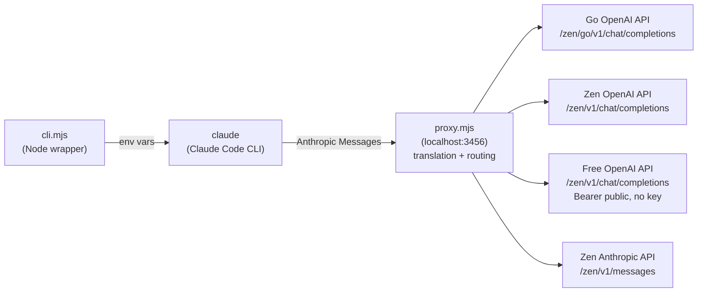

# opencodeclaude - Documentation

Run [Claude Code](https://docs.claude.com/en/docs/claude-code) against **all OpenCode plans**:

- **OpenCode Free** - no account, no key, free models only (e.g. `deepseek-v4-flash-free`)
- **OpenCode Zen** - pay-as-you-go (Claude, Qwen, GPT, DeepSeek, Kimi, GLM, ...)
- **OpenCode Go** - flat fee (Kimi, DeepSeek, GLM, MiniMax, Qwen, ...)

One command, paste your key once (or pick `free`), everything else just works. A local wrapper starts a proxy, sets the env vars, and launches `claude`.

> Prerequisites: the `claude` CLI and Node.js 20+.

**Contents**
1. [What this does](#what-this-does)
2. [How it works](#how-it-works)
3. [Install](#install)
4. [First run](#first-run)
5. [Usage](#usage)
6. [Changing the model](#changing-the-model)
7. [Uninstall](#uninstall)
8. [Troubleshooting](#troubleshooting)
9. [Known limits](#known-limits)
10. [Self-check](#self-check)

---

## What this does

Claude Code normally needs an Anthropic API key. This project lets you run the official Claude Code CLI on an **OpenCode** subscription instead:

- Free your coding sessions from Anthropic billing
- One key covers both paid plans - or go **fully free** with no key at all
- Pick from all Go + Zen models inside Claude Code's own `/model` picker

No patching, no fork - the CLI stays official and untouched.

---

## How it works



Two pieces:

1. **Wrapper** (`cli.mjs`) - a cross-platform Node script (no PowerShell/pwsh required): resolves your key/plan, starts the proxy, sets the env vars, launches `claude`, then tears the proxy down when `claude` exits. Any stale proxy on the port is killed first, so you always run current code.
2. **Proxy** (`proxy.mjs`) - a single-file, zero-dependency Node server. Claude Code only speaks the **Anthropic Messages** format, but every Go-plan model is **OpenAI-format only**. The proxy translates between the two and routes each request to the right endpoint. It also sends the `x-opencode-*` identity headers and a conversation-stable session id that make opencode.ai treat requests as coming from a real opencode client (mirroring how [9router](https://github.com/decolua/9router) connects to OpenCode Free), and injects `reasoning_content` for reasoning models (DeepSeek/Kimi).

### Proxy endpoints

| Endpoint | Purpose |
|---|---|
| `POST /v1/messages` | incoming from Claude Code, routed + translated |
| `GET /v1/models` | live model catalog (go + zen, prefixed) |
| `GET /health` | liveness check (used by the wrapper to kill stale proxies) |

Default port: `3456`.

### Routing rules

`route()` in `proxy.mjs` decides the endpoint from the model name:

| Model | Endpoint | Notes |
|---|---|---|
| `claude-*` | Zen `/zen/v1/messages` | native Anthropic, `x-api-key`, pass-through |
| `qwen3*` | Zen `/zen/v1/messages` | native Anthropic (unless forced to `go`) |
| `*-free` | Zen `/zen/v1/chat/completions` | free tier, OpenAI format, `Bearer public` (no key) |
| others | Go `/zen/go/v1/chat/completions`, Zen `/zen/v1/chat/completions`, or free `/zen/v1/chat/completions` | depends on plan / prefix |

The endpoint prefix overrides the plan: `anthropic-go/<id>` -> Go, `anthropic-zen/<id>` -> Zen, no prefix -> the plan default. The old `opencode-go/` and `opencode-zen/` prefixes are still accepted (backward compatibility). The proxy strips the prefix and forwards the real id upstream.

The same key works for both plans (a Go-plan key is accepted on Zen endpoints too).

### Env vars set by the wrapper

```text
ANTHROPIC_BASE_URL              = http://127.0.0.1:3456   (local proxy)
ANTHROPIC_API_KEY / AUTH_TOKEN  = <your OpenCode key>
ANTHROPIC_MODEL                 = <default per plan>
ANTHROPIC_DEFAULT_OPUS_MODEL    = <opus tier per plan>
ANTHROPIC_DEFAULT_SONNET_MODEL  = <sonnet tier per plan>
ANTHROPIC_DEFAULT_HAIKU_MODEL   = <haiku tier per plan>
CLAUDE_CODE_SUBAGENT_MODEL      = <haiku tier per plan>
CLAUDE_CODE_ENABLE_GATEWAY_MODEL_DISCOVERY = 1
CLAUDE_CODE_DISABLE_UNKNOWN_MODEL_WINDOW_ENFORCEMENT = 1   (only when OPENCODE_DISABLE_WINDOW_ENFORCEMENT=1)
CLAUDE_CODE_DISABLE_NONESSENTIAL_TRAFFIC = 1
OPENCODE_API_KEY                = <passed to the proxy (empty on the free plan)>
OPENCODE_PLAN                   = free|go|zen (default: go)
```

### Proxy env vars (optional)

| Env var | Default | Purpose |
|---|---|---|
| `OPENCODE_CONNECT_TIMEOUT_MS` | `60000` | max time to wait for upstream response headers before aborting |
| `OPENCODE_CONTEXT_LENGTH` | `200000` | context window reported to Claude Code via `/v1/models` (drives compaction) |
| `OPENCODE_FORWARD_BETA` | off | forward a *filtered* set of `anthropic-beta` headers on the Claude route (`prompt-caching-*`, `cache-*`, `context-*`) to enable token-efficiency features; off by default because Zen sometimes rejects beta headers |
| `OPENCODE_DISABLE_WINDOW_ENFORCEMENT` | off | set `1` to restore the old behaviour (window enforcement off, history never auto-compacts) |

### Observability

Every proxied request is logged as one JSON line to **`%APPDATA%\opencodeclaude\proxy.log`** (or `~/.config/opencodeclaude/proxy.log`). Keys / Authorization / message bodies are **never** logged:

```json
{"t":"2026-08-15T14:00:00.000Z","requestId":"...","model":"deepseek-v4-flash","sessionId":"ses_...","route":"openai","provider":"go","status":200,"ms":3120,"in":12450,"out":812,"cacheRead":0,"cacheWrite":0,"toolCalls":1}
```

- `in` / `out` / `cacheRead` come straight from the upstream response.
- `cacheRead` growing between turns of the same session = prompt caching is actually working.
- `status:"aborted"` / `error:"aborted"` = the client stopped and the upstream fetch was cancelled (no more tokens produced).


---

## Install

### Windows

```powershell
powershell -ExecutionPolicy Bypass -File F:\Project\opencodeclaude\install.ps1
```

Or hosted:

```powershell
irm https://raw.githubusercontent.com/dimassfeb-09/opencodeclaude/main/install.ps1 | iex
```

### Linux / macOS (requires Node.js)

```bash
curl -fsSL https://raw.githubusercontent.com/dimassfeb-09/opencodeclaude/main/install.sh | sh
```

### Result

Windows:

```
Files: C:\Users\<user>\AppData\Local\Programs\opencodeclaude
Shim:  C:\Users\<user>\AppData\Roaming\npm\opencodeclaude.cmd
```

Linux / macOS:

```
Files: ~/.local/share/opencodeclaude
Shim:  ~/.local/bin/opencodeclaude
```

Open a **new terminal**, then run `opencodeclaude`.

No installer, just a local shim:

```powershell
function opencodeclaude { node "F:\Project\opencodeclaude\cli.mjs" @args }
```

```bash
opencodeclaude() { node "$HOME/opencodeclaude/cli.mjs" "$@"; }
```

---

## First run

The first time you run `opencodeclaude`, it asks two things:

1. **Choose the plan** - `1` = go, `2` = zen, `3` = free (default: go)
2. **Enter your OpenCode API key** - get one at https://opencode.ai/auth *(only for go/zen; the free plan needs no key)*

Everything is saved to `%APPDATA%\opencodeclaude\config` (or `~/.config/opencodeclaude/config` on Linux/macOS) with restrictive permissions. Every run after that just works.

### Going fully free

No account, no key, no billing - just free models:

```powershell
opencodeclaude plan free
opencodeclaude
```

The free plan runs on the opencode **`/zen/v1`** endpoint with the dummy `public` bearer token, using whichever free models opencode currently offers (auto-fetched by the proxy from `/zen/v1/models`). Model availability fluctuates over time and is subject to rate limits.

### Managing the key and plan

Key resolution order: **config file -> env var `OPENCODE_API_KEY` -> interactive prompt**.

| Command | Purpose |
|---|---|
| `opencodeclaude config` | change key (interactive) |
| `opencodeclaude config <KEY>` | change key inline |
| `opencodeclaude plan go\|zen\|free` | choose which plan's endpoint to use (free needs no key) |
| `opencodeclaude plan` | show the active plan |
| `opencodeclaude reset` | delete the stored key |
| `opencodeclaude log` | show the last 100 proxy log lines |
| `opencodeclaude log -f` | follow new log lines live (Ctrl+C to stop) |
| `opencodeclaude update` | update the program files from GitHub (git pull in a repo, re-download in an installed copy) — **your config/keys are never touched** |

---

## Usage

```powershell
opencodeclaude                          # interactive Claude Code
opencodeclaude "refactor this module"   # one-shot prompt
opencodeclaude --model kimi-k3          # override the default model
opencodeclaude --model anthropic-zen/claude-opus-4-8   # endpoint-specific model
opencodeclaude plan zen                 # switch plan
opencodeclaude plan free                # no key needed - free models only
```

CLI arguments are passed straight through to `claude`, so all `claude` flags still apply.

---

## Changing the model

There are three ways to change which model runs.

### 1. The `/model` picker (interactive)

Inside Claude Code, press `/model`. The picker shows:

- **5 built-in tier rows** (Default / Opus / Sonnet / Haiku / Fable), mapped from `ANTHROPIC_DEFAULT_*_MODEL`
- **The gateway section** with all models discovered from `/v1/models`, prefixed so go and zen can be told apart:

```text
anthropic-go/kimi-k3              -> kimi-k3 (go)   - Go, flat fee
anthropic-zen/kimi-k3             -> kimi-k3 (zen)  - Zen, pay-as-you-go
anthropic-zen/claude-sonnet-5     -> claude-sonnet-5 (zen)
```

### 2. The `--model` flag (one session)

```powershell
opencodeclaude --model anthropic-go/kimi-k3
```

Any model id works, even ones not shown in the picker.

### 3. Default tiers per plan

The Default / Opus / Sonnet / Haiku tiers resolve to:

| Tier | Go plan | Zen plan | Free plan |
|---|---|---|---|
| Opus (thinking) | `deepseek-v4-flash` | `claude-opus-4-8` | `deepseek-v4-flash-free` |
| Sonnet (default) | `deepseek-v4-flash` | `claude-sonnet-4-6` | `deepseek-v4-flash-free` |
| Haiku (subagent) | `deepseek-v4-flash` | `claude-haiku-4-5` | `deepseek-v4-flash-free` |

### Why does the picker show only a handful? - and why the "Gateway" label

Claude Code's `/model` picker does not automatically list gateway models. Three rules come from Claude Code itself:

1. **Opt-in discovery** - since v2.1.129, the gateway `/v1/models` is only read by the picker when `CLAUDE_CODE_ENABLE_GATEWAY_MODEL_DISCOVERY=1` is set (the wrapper sets it automatically).
2. **ID filter** - only models whose ID starts with `claude` or `anthropic` are added to the list. That is why our prefix is `anthropic-go/` / `anthropic-zen/`, not `opencode-`.
3. **Section label** - discovered models are grouped by Claude Code under the hardcoded **"Gateway"** label (the same label is used for every non-Anthropic gateway: Bedrock, NIM, proxies, etc.). It is Claude Code's own text and cannot be changed from the gateway side. What we can control is each model's `display_name` (e.g. `kimi-k3 (go)`).

Without discovery (e.g. an older Claude Code version), any model still works by typing the full id: `/model anthropic-go/kimi-k3` or `claude --model anthropic-go/kimi-k3`.

---

## Uninstall

Easiest - run from anywhere (stops the proxy, removes the shim, installed files, and stored config):

```powershell
opencodeclaude --uninstall
```

Or run the uninstall script:

```powershell
powershell -ExecutionPolicy Bypass -File F:\Project\opencodeclaude\uninstall.ps1
```

```bash
./uninstall.sh    # Linux / macOS
```

Or remove manually:

```powershell
Remove-Item -Force "$env:APPDATA\npm\opencodeclaude.cmd"
Remove-Item -Recurse -Force "$env:LOCALAPPDATA\Programs\opencodeclaude"
Remove-Item -Recurse -Force "$env:APPDATA\opencodeclaude"   # stored key + plan
```

---

## Troubleshooting

| Symptom | Cause | Fix |
|---|---|---|
| `/model` shows only 5 rows | discovery off / old version | check claude version (>=2.1.129) and the discovery env var |
| `/model` does not list non-claude models | Claude Code ID filter (`claude`/`anthropic`) | use the `anthropic-` prefix, or type the full id |
| "Gateway" section label | hardcoded Claude Code text | normal, not a bug |
| `403 RegionError` on `deepseek-v4-flash` | China-hosted model needs opt-in | enable at https://opencode.ai/workspace/.../go |
| `429 FreeUsageLimitError` on `*-free` | free tier rate limit | wait, or switch to a paid model |
| free plan shows only `*-free` models | free models are a subset of the catalog | opencode decides what's free; the list changes over time |
| `401` on a `*-free` model | free model dropped from the promo | pick another free model, or use the go/zen plan |
| `401 Insufficient balance` on Zen | empty Zen balance | top up billing, or use the Go plan |
| "Unknown model" error | model name typo | `/model <id>` with the exact id from `/v1/models` |
| Port 3456 held by a stale proxy | previous process did not exit | the wrapper kills it automatically at launch |
| no `proxy.log` / log is empty | proxy started with `stdio: ignore` | restart `opencodeclaude` (current wrapper redirects proxy output to the log) |
| `cacheRead` is always `0` in the log | provider does not report cached tokens, or prompt cache never hits | check the model is reached again with the same `sessionId`; opencode-side caching is server-side (UNVERIFIED from the proxy) |
| `in` is `0` on streamed requests | streaming final usage chunk missing | expected for some providers; non-stream requests always report real `in` |
| 400 on a `claude-*` model | Zen rejected the forwarded beta header | don't set `OPENCODE_FORWARD_BETA=1` (default is off) |

---

## Known limits

- **GPT / Grok / Gemini on Zen** use the Responses / Gemini APIs, not chat/completions - not supported. Grok *on the Go plan* works (it is a chat-completions model there).
- Zen sometimes rejects the beta headers / `context_management` fields Claude Code sends on some Claude families. If you hit a 400 on a Claude model, pin a tolerant `ANTHROPIC_BETA` or use a non-Claude default.
- Tool calls are translated via OpenAI `tool_calls`; image blocks are not forwarded (text-only upstream).

---

## Self-check

```powershell
node test.mjs
```

Tests `route()`, `toOpenAI()`/`fromOpenAI()`, `translateStream()`, and `countTokens()` without a server.
